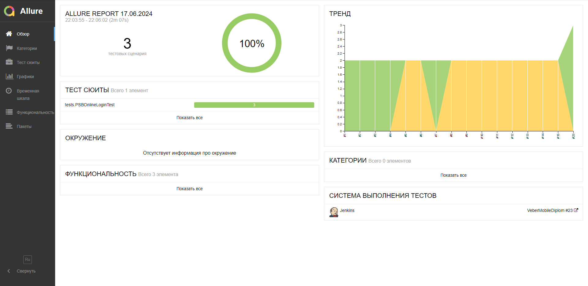
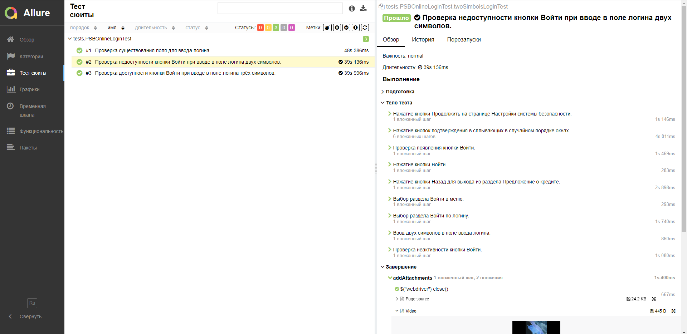
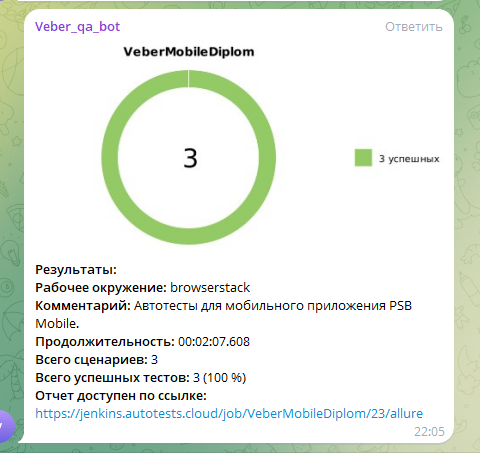

<a id="наверх"></a>
<h1 align="center">Проект по автоматизации тестирования мобильного приложения PSB Mobile.</h1>
<p align="center">

</p>

>ПАО Промсвязьбанк (ПСБ) — универсальный банк в РФ | Входит в 10 крупнейших банков России.

##  Содержание:
- <a href="#cases"> Тест-кейсы</a>
- <a href="#autotests"> Запуск автотестов</a>
- <a href="#jenkins"> Сборка в Jenkins</a>
- <a href="#allureReport"> Пример Allure-отчета</a>
- <a href="#tg"> Уведомления в Telegram с использованием бота</a>
- <a href="#movie">Видеопример прохождения тестов Browserstack</a>


Тесты написаны на языке <code>Java</code> с использованием фреймворка для автоматизации тестирования <code>[Selenide](https://selenide.org/)</code>, сборщик - <code>Gradle</code>.

<code>JUnit 5</code> задействован в качестве фреймворка модульного тестирования.

Для локального тестирования приложения на мобильных устройствах используется <code>Android Studio</code> и <code>Appium</code>.
Для удаленного тестирования в различных платформах <code>Browserstack</code>

Для удаленного запуска реализована джоба в <code>Jenkins</code> с формированием Allure-отчета
и отправкой результатов в <code>Telegram</code> при помощи бота.

____
<a id="cases"></a>
## Тест-кейсы
- Проверка отображения кнопки Войти при вводе трёх символов в поле ввода логина
- Проверка недоступности кнопки Войти при вводе трёх символов в поле ввода логина

____
<a id="autotests"></a>
## Команда для запуска автотестов из терминала

Запуск удаленно на Browserstack:
```bash 
gradle clean test -DdeviceHost=browserstack
```
Запуск локально на эмуляторе:
```bash 
gradle clean test -DdeviceHost=emulation
```
> Для запуска локальных тестов на компьютере должны быть установлены Android Studio, Appium Server и Appium ([инструкция](https://autotest.how/appium-setup-for-local-android-tutorial))

Запуск локально на реальном устройстве:
```bash 
gradle clean test -DdeviceHost=real
```
> Для запуска локальных тестов на реальном устройстве на компьютере должны быть установлены Android Studio, Appium Server и Appium, так же устройство должно быть подключено к компьютеру
> и код устройства должен быть заменен в параметре device.name файла host/real.properties

---
<a id="jenkins"></a>
## Сборка в <a target="_blank" href="https://jenkins.autotests.cloud/job/VeberMobileDiplom/"> Jenkins </a>
Для доступа в Jenkins необходима регистрация на ресурсе [Jenkins](https://jenkins.autotests.cloud/) 
Для запуска сборки необходимо нажать кнопку <code>Build now</code>.
<p align="center">

</p>
После выполнения сборки, в блоке <code>Build History</code> напротив номера сборки появятся значки 
<code>Allure Report</code>, при клике на которые откроется страница с сформированным html-отчетом.

____
<a id="allureReport"></a>
## Пример <a target="_blank" href="https://jenkins.autotests.cloud/job/VeberMobileDiplom/4/allure/"> Allure-отчета </a>

### Главная страница отчета
<p align="center">

</p>

### Тест-кейсы

<p align="center">

</p>

### Графики

<p align="center">

</p>

____
<a id="tg"></a>
## Уведомления в Telegram с использованием бота
После завершения сборки, бот, созданный в <code>Telegram</code>, автоматически обрабатывает и отправляет сообщение с отчетом
о прогоне тестов в специально настроенный чат.
<p align="center" style="background-color: #18222d">

</p>

#### Содержание уведомления в Telegram

- Окружение
- Комментарий
- Длительность прохождения тестов
- Общее количество сценариев
- Процент прохождения тестов
- Ссылка на Allure отчет

____
<a id="movie"></a>
## Видеопример выполнения теста Browserstack
<p align="center">
   
</p>

[Наверх ⬆](#наверх)
